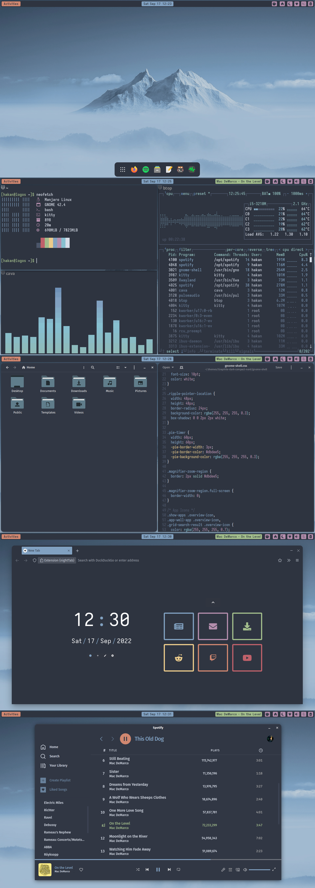

# Nordic GNOME Theme

 

 

## Apps and Sources:
- Colour scheme: [Nord](https://github.com/arcticicestudio/nord)
- GTK and base shell theme: [Graphite Nord Compact](https://github.com/vinceliuice/Graphite-gtk-theme)
- Icons: [Papirus](https://github.com/PapirusDevelopmentTeam/papirus-icon-theme), [Papirus Folders](https://github.com/PapirusDevelopmentTeam/papirus-folders)
- Firefox theme: [MinimalistFox](https://github.com/canbeardig/MinimalistFox)
- Firefox tabs: [nightTab](https://addons.mozilla.org/en-US/firefox/addon/nighttab/)
- Spotify: [Spicetify](https://github.com/spicetify)
- gedit: [Nord gedit](https://github.com/arcticicestudio/nord-gedit)
- Terminal: [Kitty](https://github.com/kovidgoyal/kitty)
- Audio Visualizer: [cava](https://github.com/karlstav/cava)
- neofetch: [Neofetch Themes](https://github.com/chick2d/neofetch-themes/)
- btop++: [btop nord](https://github.com/aristocratos/btop)
- Fonts: [Fira](https://github.com/mozilla/Fira), [Iosevka, Iosevka Aile](https://github.com/be5invis/Iosevka)
- Extensions:
  - [Dash to Dock](https://extensions.gnome.org/extension/307/dash-to-dock/)
  - [Tiling Assistant](https://extensions.gnome.org/extension/3733/tiling-assistant/)
  - [User Themes](https://extensions.gnome.org/extension/19/user-themes/)
  - [Gnome 4x UI Improvements](https://extensions.gnome.org/extension/4158/gnome-40-ui-improvements/)
  - [Media Controls](https://extensions.gnome.org/extension/4470/media-controls/)
  - [Remove app menu](https://extensions.gnome.org/extension/3906/remove-app-menu/)
  - [No overview at start-up](https://extensions.gnome.org/extension/4099/no-overview/)
  - [Unblank lock screen](https://extensions.gnome.org/extension/1414/unblank/)
  - [Impatience](https://extensions.gnome.org/extension/277/impatience/)
  - [Caffeine](https://extensions.gnome.org/extension/517/caffeine/)
  - [Show Desktop Button](https://extensions.gnome.org/extension/1194/show-desktop-button/)
